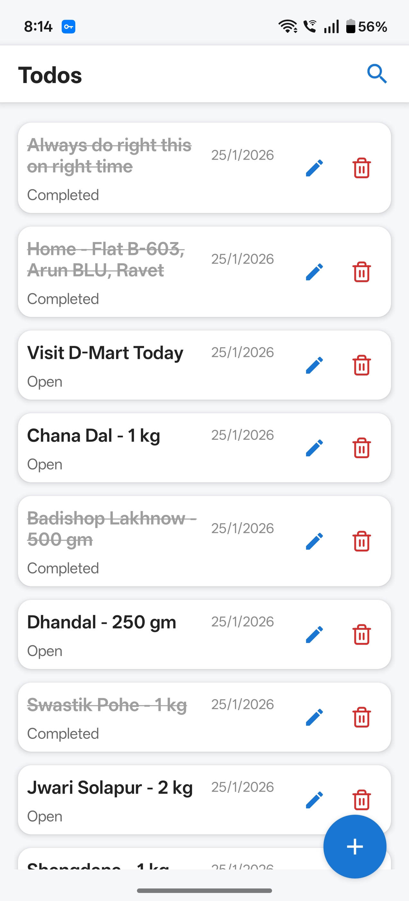
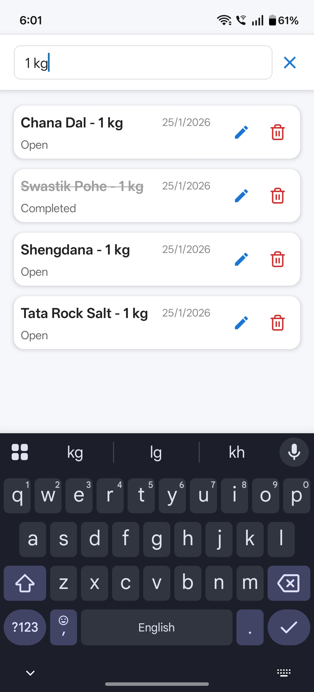
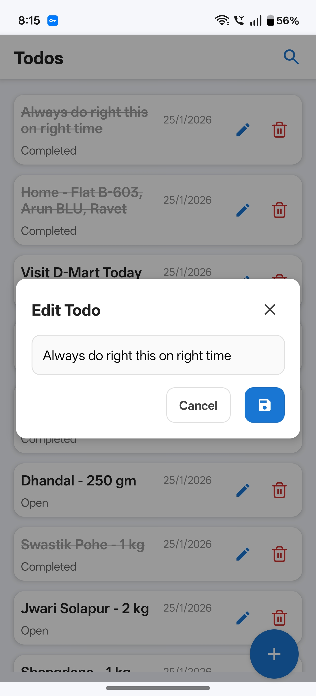

# 📱 Todo App with Expo, TypeScript & Clean Architecture

[](https://expo.dev/)
[](https://www.typescript.org/)
[](https://reactnative.dev/)

A modern, well-structured Todo application built with React Native and Expo, demonstrating best practices in mobile app
development using Clean Architecture and MVVM pattern.

## ✨ Features

- ✅ Create, read, update, and delete todos
- 🔍 Search todos by title
- 📱 Responsive UI with Material Design icons
- 🧪 Comprehensive testing (Unit, UI, E2E)
- 🏗️ Clean Architecture with MVVM pattern
- 📦 TypeScript for type safety
- 🚀 Expo for easy development and deployment

## 🛠️ Tech Stack

- **Framework**: [React Native](https://reactnative.dev/) with [Expo](https://expo.dev/)
- **Language**: [TypeScript](https://www.typescript.org/)
- **Navigation**: [React Navigation](https://reactnavigation.org/)
- **Icons**: [Expo Vector Icons](https://docs.expo.dev/guides/icons/)
- **Testing
  **: [Jest](https://jestjs.io/) + [@testing-library/react-native](https://testing-library.com/docs/react-native-testing-library/intro/)
- **E2E Testing**: [Detox](https://wix.github.io/Detox/)

## 📁 Project Structure

```
todo-app-expo-react-native/
├── src/
│   ├── domain/                 # Business Logic Layer
│   │   ├── entities/           # Core business entities (Todo)
│   │   └── usecases/           # Application business rules
│   ├── data/                   # Data Access Layer
│   │   └── repositories/       # Repository implementations
│   ├── presentation/           # Presentation Layer
│   │   ├── screens/            # UI screens (HomeScreen)
│   │   ├── components/         # Reusable UI components
│   │   └── viewmodels/         # ViewModels (MVVM pattern)
│   ├── services/               # External services
│   │   └── api.ts              # API client configuration
│   └── navigation/             # Navigation setup
├── __tests__/                  # Unit and integration tests
├── e2e/                        # End-to-end tests (Detox)
├── assets/                     # Static assets (images, fonts)
├── screenshots/                # App screenshots
└── *.json                     # Configuration files
```

## 🏛️ Architecture Overview

This project follows **Clean Architecture** principles and **MVVM (Model-View-ViewModel)** pattern to create a
maintainable and testable codebase.

### Clean Architecture Layers

1. **Domain Layer** (`src/domain/`)
    - Contains business logic independent of any framework
    - **Entities**: Core business objects (e.g., `Todo`)
    - **Use Cases**: Application-specific business rules (e.g., `CreateTodoUseCase`)

2. **Data Layer** (`src/data/`)
    - Implements data access logic
    - **Repositories**: Abstract data operations (e.g., `ITodoRepository`)
    - Handles API calls, local storage, etc.

3. **Presentation Layer** (`src/presentation/`)
    - UI-related code
    - **Screens**: Main UI components
    - **Components**: Reusable UI pieces
    - **ViewModels**: Bridge between UI and business logic

4. **Services Layer** (`src/services/`)
    - External integrations (API clients, utilities)

### MVVM Pattern

- **Model**: Domain entities and business logic
- **View**: React components (screens and UI components)
- **ViewModel**: Manages UI state and communicates with use cases

### Why This Architecture?

- **Separation of Concerns**: Each layer has a single responsibility
- **Testability**: Business logic is isolated and easy to test
- **Maintainability**: Changes in one layer don't affect others
- **Scalability**: Easy to add new features or modify existing ones

## 🚀 Getting Started

### Prerequisites

- Node.js (v14 or later)
- npm or yarn
- Expo CLI: `npm install -g @expo/cli`
- For iOS: Xcode (macOS only)
- For Android: Android Studio

### Installation

1. **Clone the repository**
   ```bash
   git clone <repository-url>
   cd todo-app-expo-react-native
   ```

2. **Install dependencies**
   ```bash
   npm install
   ```

3. **Start the development server**
   ```bash
   npm start
   ```

4. **Run on device/simulator**
    - Press `i` for iOS simulator
    - Press `a` for Android emulator
    - Scan QR code with Expo Go app on physical device

## 🧪 Testing

### Unit & UI Tests

Run all tests:

```bash
npm test
```

Run tests in watch mode:

```bash
npm run test:watch
```

### End-to-End (E2E) Tests

E2E testing requires a native build. For Expo managed projects, you need to use `expo prebuild` or EAS Build.

#### iOS (macOS only)

```bash
npm run e2e:build:ios
npm run e2e:test:ios
```

#### Android

```bash
npm run e2e:build:android
npm run e2e:test:android
```

**Note**: See [Detox documentation](https://wix.github.io/Detox/)
and [Expo documentation](https://docs.expo.dev/workflow/prebuild/) for detailed setup instructions.

## 📸 Screenshots

| List & Search Todo                          | Add & Edit Todo                         |
|---------------------------------------------|-----------------------------------------|
|      |    |
|  |  |

## 📚 Learning Resources

This project is perfect for beginners learning:

- **React Native Development**: Modern mobile app development
- **TypeScript**: Type-safe JavaScript development
- **Clean Architecture**: Organizing code for maintainability
- **MVVM Pattern**: Separation of UI and business logic
- **Testing**: Unit, integration, and E2E testing strategies
- **Expo Workflow**: Simplified React Native development

### Key Concepts to Explore

1. **Dependency Injection**: How ViewModels receive use cases
2. **Repository Pattern**: Abstracting data sources
3. **Use Cases**: Encapsulating business operations
4. **Component Composition**: Building UIs from reusable parts
5. **State Management**: Managing UI state with hooks

## 🤝 Contributing

1. Fork the repository
2. Create a feature branch (`git checkout -b feature/amazing-feature`)
3. Commit your changes (`git commit -m 'Add amazing feature'`)
4. Push to the branch (`git push origin feature/amazing-feature`)
5. Open a Pull Request

## 📄 License

This project is licensed under the MIT License - see the [LICENSE](LICENSE) file for details.

---

Built with ❤️ using React Native and Expo