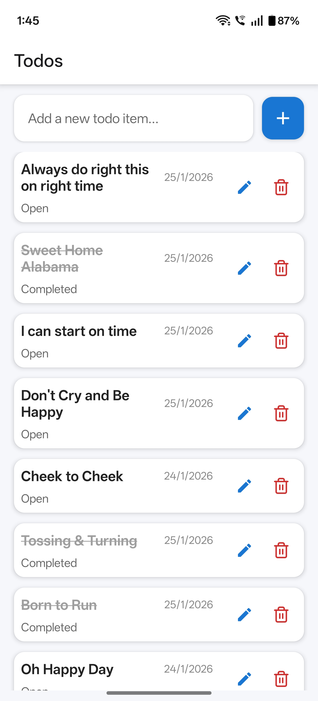

# Expo + TypeScript + MVVM (Clean Architecture)

### Overview
- Expo-managed TypeScript starter
- Clean Architecture layers: domain / data / presentation / services
- MVVM: View <-> ViewModel (presentation/viewmodels). ViewModel uses use-case(s) from domain which talk to repository interfaces.
- Tests: Jest + @testing-library/react-native for unit and UI tests. Example Detox config provided for E2E.

### Quick start
1. Install dependencies:
   npm install
2. Start (Metro / Expo):
   npm run start
3. Run unit/UI tests:
   npm test
4. E2E (Detox) — requires native build and device/simulator:
   npm run e2e:build:ios
   npm run e2e:test:ios

### Notes about Detox
- Expo managed projects need `expo prebuild` to run Detox or use EAS + dev client workflow. See Detox docs and Expo docs for details.

### Architecture mapping
- domain/: Entities and UseCases (pure business logic)
- data/: repository implementations, data sources (network/local)
- presentation/: screens, components, viewmodels
- services/: api client, helpers
- navigation/: navigation setup

# Sample TODO App

### Screenshots

| TODO List                               | TODO Edit                               |
|-----------------------------------------|-----------------------------------------|
|  |  |